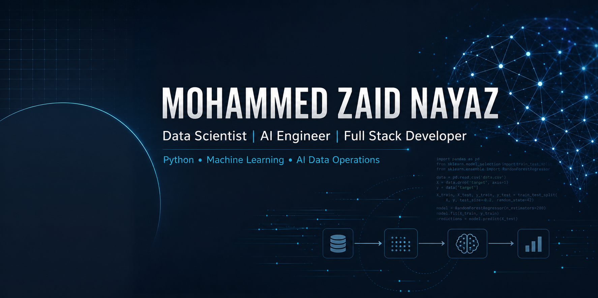

  

<h1 align="center">Hi, I'm Mohammed Zaid Nayaz</h1>

  <b>Data Scientist | AI Engineer | Full Stack Developer</b> 
  Python, Machine Learning, AI Data Operations, ETL, React.js, Node.js, and product-minded engineering.

  <a href="https://zaidnayaz.github.io/Mohammed_Zaid_Nayaz_Portfolio/?v=20260729-depth">Portfolio</a>
  &nbsp;|&nbsp;
  <a href="https://github.com/zaidnayaz">GitHub</a>
  &nbsp;|&nbsp;
  <a href="https://www.linkedin.com/in/mohammed-zaid-nayaz?utm_source=share&utm_campaign=share_via&utm_content=profile&utm_medium=android_app">LinkedIn</a>

---

## About Me

I am a BCA graduate based in Bengaluru with hands-on experience across data science, AI engineering, AI data operations, and full-stack development. I have worked on Python analytics, ETL workflows, data cleaning, feature engineering, project documentation, and AI data pipeline coordination.

At BUILD.AI, I coordinated real-world AI data collection operations across 30,000+ hours of collected data and 100+ team members. I also worked as a Data Science / AI Engineer Intern at Applic Coders Software Solution, focusing on practical data science workflows and industry-ready software documentation.

---

## Tech Stack

### Data Science & AI
`Python` `Pandas` `NumPy` `SQL` `Machine Learning` `ETL` `Feature Engineering` `Data Analysis` `Computer Vision`

### Full Stack Development
`React.js` `Node.js` `Express.js` `REST APIs` `HTML` `CSS` `JavaScript` `MongoDB` `MySQL` `PostgreSQL`

### Tools & Workflow
`Git` `GitHub` `Power BI` `Documentation` `Database Design` `UI/UX Planning` `Team Coordination`

---

## Featured Projects

| Project | Description | Tech |
|---|---|---|
| [SafeCityAI Traffic Violation Detection](https://github.com/zaidnayaz/SafeCityAi-trafficviolation) | AI-powered traffic violation detection for helmet, no-helmet, and license plate use cases with FastAPI, React, and object detection workflow planning. | Python, Computer Vision, YOLO, FastAPI, React.js |
| [Personal Portfolio](https://github.com/zaidnayaz/Mohammed_Zaid_Nayaz_Portfolio) | Professional portfolio website showcasing projects, experience, AI data operations impact, education, certifications, and resume. | HTML, CSS, JavaScript, GitHub Pages |
| [Internship Day 1 to 6 Project](https://github.com/zaidnayaz/Internship_Day_1_to_6_Project) | Internship documentation and project foundation covering GitHub management, project architecture, database design, UI/UX planning, and daily learning logs. | JavaScript, Documentation, GitHub |
| Retail Demand Forecasting Analytics | Data science project for retail demand forecasting using ETL, data cleaning, sales analysis, and PostgreSQL schema planning. | Python, Pandas, SQL, PostgreSQL, Forecasting |
| Customer Churn Prediction Dashboard | Dashboard concept for churn prediction, customer segmentation, business insights, and stakeholder-friendly analytics. | Python, Machine Learning, Dashboard Design |
| ZASA Fashion E-Commerce Website | Responsive e-commerce website focused on fashion product browsing, clean UI, and full-stack shopping flow planning. | React.js, Node.js, Express.js, MongoDB |

---

## GitHub Snapshot

<!-- AUTO-GENERATED-START -->
_Last refreshed: 10 Aug 2026, 08:58 UTC_

| Metric | Value |
|---|---:|
| Public repositories | 4 |
| Total stars | 0 |
| Total forks | 0 |
| Top repository languages | Documentation (1), HTML (1), JavaScript (1), Python (1) |

### Recently Updated Repositories

- [zaidnayaz](https://github.com/zaidnayaz/zaidnayaz) - Self-updating GitHub profile README for Mohammed Zaid Nayaz `updated 09 Aug 2026`
- [Mohammed_Zaid_Nayaz_Portfolio](https://github.com/zaidnayaz/Mohammed_Zaid_Nayaz_Portfolio) - Professional portfolio website for Mohammed Zaid Nayaz - Data Scientist, AI Engineer, and Full Stack Developer. `updated 28 Jul 2026`
- [Internship_Day_1_to_6_Project](https://github.com/zaidnayaz/Internship_Day_1_to_6_Project) - Six-day data science internship project with daily logs, GitHub documentation, project architecture, database design, and UI/UX planning. `updated 20 Jul 2026`
- [SafeCityAi-trafficviolation](https://github.com/zaidnayaz/SafeCityAi-trafficviolation) - SafeCityAI is a production-ready AI object detection project for detecting: Helmet No_Helmet License_Plate It includes a FastAPI backend, a premium... `updated 16 Jul 2026`
<!-- AUTO-GENERATED-END -->

---

## Currently Focused On

- Building stronger data science and AI engineering projects.
- Improving full-stack product development skills.
- Documenting projects professionally for recruiters and collaborators.
- Learning practical machine learning, data pipelines, and production-ready software workflows.

---

  <b>Open to opportunities in Data Science, AI Engineering, Data Analysis, Python Development, and Full Stack Development.</b>

